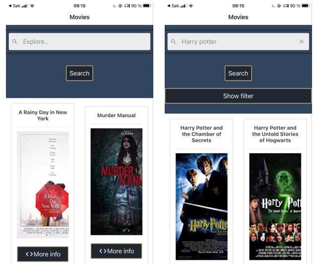

# Movie Explorer app

## Oppsett av prosjektet
Klon prosjektet fra gitlab
### `git clone SSH/HTTP nøkkel`

cd inn i MovieApp-mappen:
#### `it2810prosjekt_4->MovieApp`

I prosjekt directorien kjører du
#### `npm install`
Backend kjører kontinuerlig på vm, derfor trenger du bare å kjøre frontend  
#### Kjør på mobil:
#### `expo start`
For å kjøre på mobil må du laste ned expo.  
IOS: gå på kamera og scann QR-koden 
Android: Scan QR-koden i expo-appen

#### Kjør i nettleser:
#### `npm run web`

Movie Explorer er en applikasjon for både iphone og android.
Her kan brukeren søke i en database med over 62 058 forskjellige 
filmer, og filtrere etter ønsket sjanger og utgivelsesår på søket som er utført. 
Ved å klikke på “mer info” på en film kan brukeren få opp 
info om utgivelsesår og tilhørende sjanger til filmen. 
Når et søk gir et større resultat kan brukeren bla seg 
videre med knappene nederst på appen. Appen baserer seg på React Native med Redux. 
 

## Tekonolgi

Mye av teknologien har basert seg på gjenbruk av prosjektet 3.
Backend ble urørt og satt over på vm for å slippe og starte den manuelt . 
Redux logikken brukte vi helt likt som i prosjekt 3 og komponentstrukturen 
ble også svært lik bortsett fra at HTML ble byttet ut med React Native syntax
annet enn HTML ble erstattet med React Native syntax. Fetchkallet vårt ble også 
funpusset for en mer “rikitg” kode.

### TredjepartsKomponenter

Med React Native er det flere muligheter til å benytte seg av mange forskjellige
tredjepartskomponenter. Vi har i dette prosjektet brukt “react-native-elements” 
ettersom det var god dokumentasjon og de hadde rammeverk for alle komponentene 
vi skulle ta i bruk. Derfor valgte vi bare å bruke react-native-elements 
ettersom prosjektet ikke skulle være for komplekst. Om vi hadde hatt mer 
tid at vi tatt i bruk en annen tredjepartskomponent til utformingen av 
selve kortene som filmene holdt seg inne i. Dette fordi vi opplevde at 
Iphone og Android responderte forskjellig til teknologien. Dette oppdaget 
vi dessverre litt for sent og det kunne vært bedre fulgt opp ved å benytte 
seg hyppigere av end-to-end testing. 

### Expo

I utviklingen har vi brukt expo-cli både for å initiere prosjektet gjennom expo 
init og for å manuelt brukerteste applikasjonen ende-til-ende på iOS og Android.

###  Typescript

Typescript forbedrer kodekvaliteten, og gjør den mer forståelig. 
I tillegg unngår man vanlig feil som oppstår med Javascript som å glemme å deklarere en variabel eller kalle på en ikke-eksisterende funksjon.
Typescript er lett å overføre til andre utviklere.

###  React Native
Hoppet fra react til react native har ikke vært for stort ettersom oppsettet er nokså likt, bare ny syntax. Den store forskjellen var stylingen. 
I steden for å ha egne CSS filer så stylet vi direkte i komponenten. Dette var uvant, og koden 
bærer preg av lite egendesignet styling. Vi har lent oss mye på react-native-elements sine “stylinger”. 

## Testing
Det har blitt utført manuell end-2-end testing på appliaksjonen. Søk, filter, sortering og blaing mellom sider fungerer på iOS og Android. 
Under implementering har appen blitt testet på iOS ettersom begge utviklerene hadde denne mobiltypen. Da vi testet for Android så vi at all funksjonaliteten var bevart, men bildene skalerte seg ikke like pent her. 
Vi valgte å nedprioritere dette ettersom annen funksjonalitet ble prioritert.